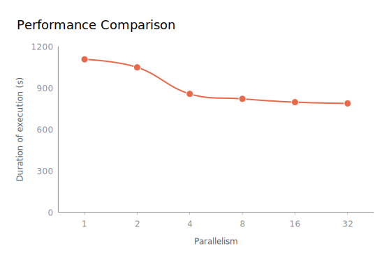

## IP-Flink-Query7

This is the code repository for the project "*Query processing over streaming data using Flink*"

Inspired by the *Cquirrel* project, this project is targeted at solving streaming query for TPC-H's Query 7.

### Environment Requirement

- System environment: Windows 11 & Ubuntu 22.04.3 LTS for WSL2
- Java: JDK 1.8.0_391
- Flink: 1.19.0
- Python: 3.8.5
- Maven: 3.9.6

### Generate the input data

Initially, use the TPC-H Tools to generate 1GB of data, as the *Cquirrel* Demo does, then copy all **.tbl* data files into the *DemoTools/DataGenerator* directory. By using *data_generator_for_query7*, load the required *.tbl* files, and output a CSV file as the input source file for the data stream processing.

### Directory Description

**DemoTools/DataGenerator**: This is the tool to generate our input data files. *DataGenerator.py* is used to generate all tables data, while *DG_for_Query7.py* is used to generate the input data source for TPC-H Query 7 processing.

**src/main/java**: This is the main code folder, where *ExecuteQuery* is the mainClass, and the *Tables* subdirectory is used to define the five tables that will actually be used in the query and some corresponding methods. And in particular, ProcessFunctionForQuery7 implements the core Insert, Insert-Update, Delete and Delete-Update algorithms.

**target**: This directory will contain exported *jar* package (by using Maven with pom.xml) that can be uploaded to run in a Flink cluster (including Web UI or CLI).

### Running tips in IDE (e.g., IntelliJ IDEA)

To avoid errors such as *ClassNotFoundException*, please edit configuration before running: 

E.g., Add dependencies with "provided" scope to classpath.

### References

*Cquirrel* demo: https://cse.hkust.edu.hk/~yike/Cquirrel.pdf

Full paper: https://cse.hkust.edu.hk/~yike/sigmod20.pdf

### TPC-H Query 7 in SQL:

```sql
select
    supp_nation,
    cust_nation,
    l_year, sum(volume) as revenue
from (
    select
       n1.n_name as supp_nation,
       n2.n_name as cust_nation,
       extract(year from l_shipdate) as l_year,
       l_extendedprice * (1 - l_discount) as volume
    from
       supplier,lineitem,orders,customer,nation n1,nation n2
    where
       s_suppkey = l_suppkey
       and o_orderkey = l_orderkey
       and c_custkey = o_custkey
       and s_nationkey = n1.n_nationkey
       and c_nationkey = n2.n_nationkey
       and (
          (n1.n_name = '[NATION1]' and n2.n_name = '[NATION2]')
          or (n1.n_name = '[NATION2]' and n2.n_name = '[NATION1]')
       )
       and l_shipdate between date '1995-01-01' and date '1996-12-31'
    ) as shipping
group by
    supp_nation,
    cust_nation,
    l_year
order by
    supp_nation,
    cust_nation,
    l_year;
```

**Note**: 
Supplier country and customer country settings in Query 7: China and United States.


**Performance analysis:**

